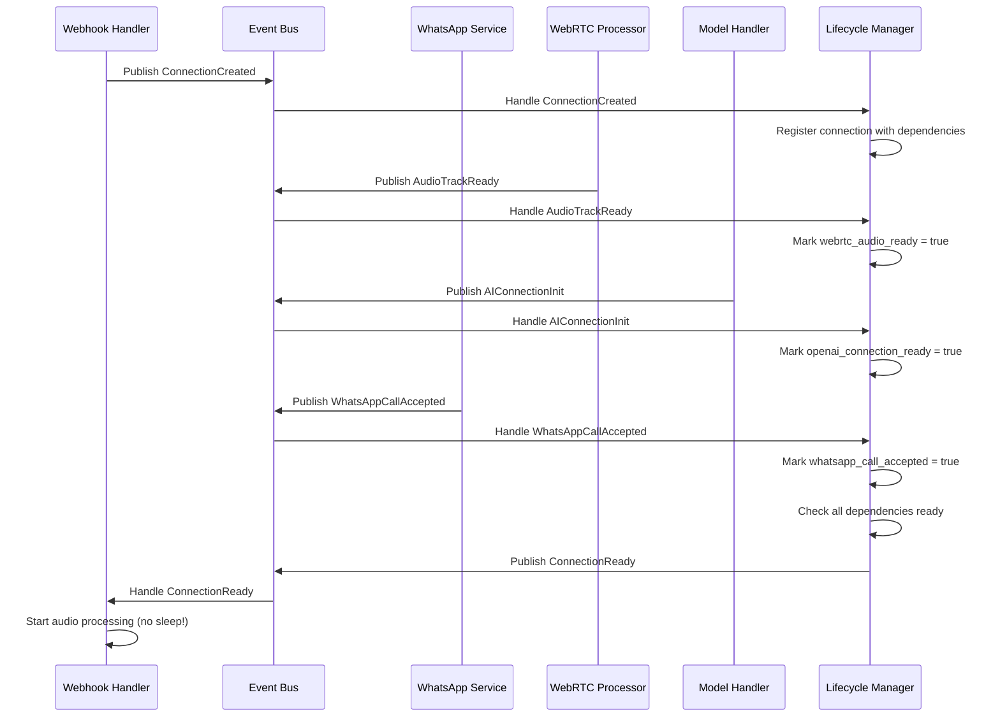

# Event Bus System

## 概述

事件总线系统是 WhatsApp Call Gateway 的核心组件，用于协调各个服务之间的异步通信。它替代了原有的 `time.Sleep` 轮询机制，提供了一个高效、可扩展的事件驱动架构。

## 核心组件

### 1. EventBus (`bus.go`)
事件总线的核心实现，提供事件发布和订阅功能。

**主要功能：**
- 事件发布 (`Publish`, `PublishEvent`)
- 事件订阅 (`Subscribe`, `SubscribeWithTimeout`)
- 中间件支持 (`Use`)
- 统计信息 (`GetStats`)

### 2. Events (`events.go`)
定义了所有事件类型和数据结构。

**事件类型：**
- **连接生命周期**: `ConnectionCreated`, `ConnectionReady`, `ConnectionTerminated`
- **WebRTC 事件**: `SDPOfferReceived`, `AudioTrackReady`, `ICEConnectionChanged`
- **AI 事件**: `AIConnectionInit`, `AIAudioReady`, `AIDataChannelReady`
- **WhatsApp 事件**: `WhatsAppCallStarted`, `WhatsAppCallAccepted`, `WhatsAppAudioReady`

### 3. Lifecycle (`lifecycle.go`)
管理连接的生命周期，跟踪依赖关系和状态转换。

**主要功能：**
- 连接注册和依赖管理
- 状态转换跟踪
- 自动就绪检测
- 连接清理

### 4. Middleware (`middleware.go`)
提供各种中间件功能，增强事件处理能力。

**可用中间件：**
- `LoggingMiddleware`: 事件日志记录
- `MetricsMiddleware`: 性能指标收集
- `RecoveryMiddleware`: 异常恢复
- `TimeoutMiddleware`: 超时处理
- `ValidationMiddleware`: 事件验证
- `RateLimitMiddleware`: 速率限制
- `DeduplicationMiddleware`: 重复事件过滤

## 使用示例

### 基础使用

```go
// 创建事件总线
eventBus := eventbus.NewEventBus()

// 添加中间件
middlewares := eventbus.CreateDefaultMiddlewareChain()
for _, middleware := range middlewares {
    eventBus.Use(middleware)
}

// 订阅事件
eventBus.Subscribe(eventbus.AudioTrackReady, func(event *eventbus.ConnectionEvent) {
    log.Printf("Audio track ready for connection: %s", event.ConnectionID)
    
    if data, ok := event.GetWebRTCData(); ok {
        log.Printf("Track type: %s, SSRC: %d", data.TrackType, data.SSRC)
    }
})

// 发布事件
eventBus.Publish(eventbus.AudioTrackReady, &eventbus.WebRTCEventData{
    ConnectionID: "conn_123",
    TrackType:    "audio",
    SSRC:         12345,
})
```

### 生命周期管理

```go
// 创建生命周期管理器
lifecycle := eventbus.NewConnectionLifecycle(eventBus)

// 注册连接及其依赖
lifecycle.RegisterConnection(
    "conn_123",           // connection ID
    "call_456",           // call ID
    "tenant_789",         // tenant ID
    []string{             // dependencies
        "webrtc_audio_ready",
        "openai_connection_ready",
        "whatsapp_call_accepted",
    },
)

// 当依赖就绪时，会自动发布 ConnectionReady 事件
```

### 在服务中集成

```go
type MyService struct {
    eventBus  eventbus.EventBus
    lifecycle *eventbus.ConnectionLifecycle
}

func (s *MyService) Initialize() {
    // 订阅相关事件
    s.eventBus.Subscribe(eventbus.ConnectionReady, s.handleConnectionReady)
    s.eventBus.Subscribe(eventbus.AIAudioReady, s.handleAIAudioReady)
}

func (s *MyService) handleConnectionReady(event *eventbus.ConnectionEvent) {
    log.Printf("Connection %s is ready, starting audio processing", event.ConnectionID)
    // 开始音频处理，无需 sleep 等待
}

func (s *MyService) ProcessAudioTrack(connectionID string, track interface{}) {
    // 发布音频轨道就绪事件
    s.eventBus.Publish(eventbus.AudioTrackReady, &eventbus.WebRTCEventData{
        ConnectionID: connectionID,
        TrackType:    "audio",
    })
}
```

## 事件流程图



## 配置选项

### 事件总线配置

```go
// 基础配置
eventBus := eventbus.NewEventBus()

// 添加超时中间件
eventBus.Use(eventbus.TimeoutMiddleware(30 * time.Second))

// 添加速率限制
eventBus.Use(eventbus.RateLimitMiddleware(100)) // 100 events/sec

// 添加重复事件过滤
eventBus.Use(eventbus.DeduplicationMiddleware(5 * time.Second))
```

### 生产环境配置

```go
// 使用生产环境中间件链
middlewares := eventbus.CreateProductionMiddlewareChain()
for _, middleware := range middlewares {
    eventBus.Use(middleware)
}
```

## 监控和调试

### 统计信息

```go
stats := eventBus.GetStats()
log.Printf("Total events: %d", stats.TotalEvents)
log.Printf("Active handlers: %d", stats.ActiveHandlers)

for eventType, count := range stats.EventsByType {
    log.Printf("Event %s: %d times", eventType, count)
}
```

### 连接状态查询

```go
state, err := lifecycle.GetConnectionState("conn_123")
if err == nil {
    log.Printf("Connection %s is in phase: %s", state.ID, state.Phase)
    log.Printf("Ready conditions: %+v", state.ReadyConditions)
}

// 获取所有连接
allConnections := lifecycle.GetAllConnections()
for id, state := range allConnections {
    log.Printf("Connection %s: %s", id, state.Phase)
}
```

## 最佳实践

### 1. 事件命名
- 使用清晰的命名空间：`service.action` (如 `webrtc.audio_track_ready`)
- 使用过去时态表示已完成的动作
- 保持一致的命名风格

### 2. 错误处理
```go
eventBus.Subscribe(eventbus.ConnectionReady, func(event *eventbus.ConnectionEvent) {
    if event.IsError() {
        log.Printf("Connection ready event failed: %v", event.Error)
        return
    }
    
    // 正常处理逻辑
})
```

### 3. 资源清理
```go
// 确保在服务关闭时清理资源
func (s *MyService) Close() error {
    if err := s.lifecycle.Close(); err != nil {
        log.Printf("Failed to close lifecycle: %v", err)
    }
    
    return s.eventBus.Close()
}
```

### 4. 测试
```go
func TestEventHandling(t *testing.T) {
    eventBus := eventbus.NewEventBus()
    
    var receivedEvent *eventbus.ConnectionEvent
    eventBus.Subscribe(eventbus.AudioTrackReady, func(event *eventbus.ConnectionEvent) {
        receivedEvent = event
    })
    
    // 发布测试事件
    eventBus.Publish(eventbus.AudioTrackReady, &eventbus.WebRTCEventData{
        ConnectionID: "test_conn",
        TrackType:    "audio",
    })
    
    // 等待事件处理
    time.Sleep(100 * time.Millisecond)
    
    assert.NotNil(t, receivedEvent)
    assert.Equal(t, "test_conn", receivedEvent.ConnectionID)
}
```

## 迁移指南

### 替换 Sleep 轮询

**原代码：**
```go
// 等待 WAOutputTrack 可用
for i := 0; i < 50; i++ {
    time.Sleep(100 * time.Millisecond)
    waOutputTrack = connection.GetWAOutputTrack()
    if waOutputTrack != nil {
        break
    }
}
```

**新代码：**
```go
// 订阅音频轨道就绪事件
eventBus.Subscribe(eventbus.WhatsAppAudioReady, func(event *eventbus.ConnectionEvent) {
    if event.ConnectionID == connectionID {
        waOutputTrack := connection.GetWAOutputTrack()
        // 立即处理，无需等待
        processAudioTrack(waOutputTrack)
    }
})
```

### 替换固定延迟

**原代码：**
```go
// 等待 AI 就绪
time.Sleep(2 * time.Second)
if !connection.IsAIReady {
    return
}
```

**新代码：**
```go
// 订阅 AI 就绪事件
eventBus.Subscribe(eventbus.AIConnectionInit, func(event *eventbus.ConnectionEvent) {
    if event.ConnectionID == connectionID {
        // AI 已就绪，立即处理
        startAudioProcessing(connection)
    }
})
```

## 性能优化

1. **批量事件处理**: 对于高频事件，考虑批量处理
2. **异步处理**: 所有事件处理器都是异步执行的
3. **内存管理**: 定期清理过期的连接状态
4. **监控**: 使用 MetricsMiddleware 监控性能指标

## 故障排除

### 常见问题

1. **事件未被处理**: 检查订阅是否正确设置
2. **重复事件**: 使用 DeduplicationMiddleware
3. **处理超时**: 使用 TimeoutMiddleware 并调整超时时间
4. **内存泄漏**: 确保正确清理连接和取消订阅

### 调试技巧

1. 启用详细日志记录
2. 使用 ValidationMiddleware 验证事件数据
3. 监控事件统计信息
4. 检查连接生命周期状态
